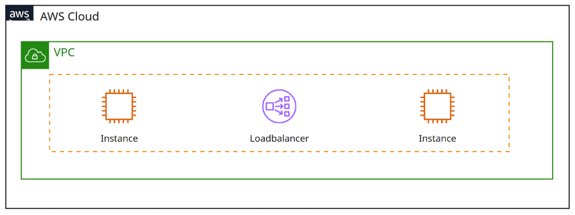

# Infrastructure as Code - Template
These configuration files provide Terraform and Ansible resources to create 2 EC2 instance with a loadbalancer within the AWS Cloud. Ansible configs install a react webapplication from a public git repository.

## Architecture

